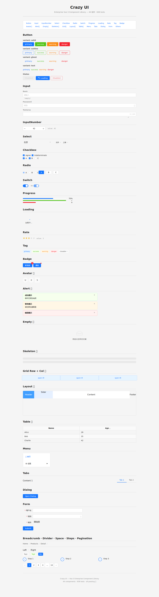

# Crazy-UI — 企业级 Vue 3 组件库

[](crazy-ui/packages/components)
[](crazy-ui/packages/components)
[](crazy-ui/tsconfig.base.json)
[](crazy-ui/packages/components/package.json)
[]()
[](crazy-ui)

从零构建的企业级 UI 组件库，采用 **框架无关核心 + Vue 3 适配层**的分层架构，所有组件通过 **TDD（Test-Driven Development）** 流程开发，拥有完整的三层设计 Token 体系。

---

## 📸 预览

所有组件效果展示：



---

## 🏗️ 架构设计

### 分层依赖图

```
┌──────────────────────────────────────────────────────┐
│                    @crazy-ui/vue                      │
│          Vue 适配层：installer / ConfigProvider        │
├──────────────────────────────────────────────────────┤
│   @crazy-ui/components   │  @crazy-ui/directives      │
│        44 个组件           │     vLoading 等指令        │
├──────────────────────────────────────────────────────┤
│         @crazy-ui/hooks (17 个 Composition API)        │
│   context(5) │ overlay(7) │ state(3) │ dom(2)          │
├──────────────────┬───────────────────────────────────┤
│  @crazy-ui/theme  │    @crazy-ui/core                 │
│  三层 Token 体系   │    框架无关类型 + 注入键            │
│  primitive→       │    TypeScript 类型系统              │
│  semantic→        │                                   │
│  component        │                                   │
├──────────────────┴───────────────────────────────────┤
│               @crazy-ui/utils                          │
│         框架无关工具函数 (DOM / Event / Object)          │
└──────────────────────────────────────────────────────┘
```

### 核心设计决策

| 决策 | 说明 |
|------|------|
| **框架无关 Core** | `@crazy-ui/core` 不依赖 Vue，仅包含 TypeScript 类型和 `unique symbol` 注入键 |
| **三层 Token** | Primitive（色板+间距基元）→ Semantic（语义角色）→ Component（组件级覆盖） |
| **BEM 命名** | `useNamespace('block')` 生成 `crazy-block__element--modifier` ，命名空间可通过 ConfigProvider 注入 |
| **Composable-first** | 组件逻辑抽取为独立 composable，可独立测试；Table 将排序/选择/筛选/展开拆分为独立 hooks |
| **严格类型** | `noUnusedLocals`、`noUnusedParameters`、`strict: true`，零容忍类型错误 |
| **TDD 流程** | 每个组件先写测试，vitest + @vue/test-utils，形成完整的回归保护网 |

---

## 📦 包结构

| 包名 | 路径 | 说明 | 状态 |
|------|------|------|------|
| `@crazy-ui/core` | `packages/core` | 框架无关类型系统 + 注入键 | ✅ |
| `@crazy-ui/theme` | `packages/theme` | 三层 Token + CSS 变量 | ✅ |
| `@crazy-ui/hooks` | `packages/hooks` | 17 个 Composition API hooks | ✅ |
| `@crazy-ui/utils` | `packages/utils` | DOM/Event 工具函数 | ✅ |
| `@crazy-ui/components` | `packages/components` | **44 个 Vue 3 组件** | ✅ |
| `@crazy-ui/directives` | `packages/directives` | 自定义指令 (vLoading) | ✅ |
| `@crazy-ui/vue` | `packages/vue` | 安装器 + ConfigProvider | ✅ |
| `@crazy-ui/icons` | `packages/icons` | SVG 图标系统 | 🔜 Phase 2 |
| `@crazy-ui/build` | `packages/build` | 构建脚本/代码生成 | 🔜 Phase 2 |

---

## 🧩 组件清单（44个）

### 基础组件
| 组件 | 说明 | 测试 |
|------|------|------|
| **Button** | solid/outline/ghost/text · 4色 · 3尺寸 · loading | ✅ |
| **Badge** | 角标/圆点 · 5色 · max 溢出 | ✅ |
| **Tag** | 5色 · light/dark/plain · closable · round | ✅ |
| **Avatar** ⭐ | circle/square · src/icon/text fallback · 语义尺寸 | ✅ |
| **Loading** ⭐ | spinner / 文字 / fullscreen / Transition | ✅ |
| **Rate** ⭐ | 半星 / hover / 键盘导航 / ARIA radiogroup | ✅ |

### 表单组件
| 组件 | 说明 | 测试 |
|------|------|------|
| **Input** | text/password/textarea · clearable · wordLimit · autosize | ✅ |
| **InputNumber** | 步进器 · precision · controlsPosition | ✅ |
| **Select** | 单选/多选 · filterable · remote · allowCreate · collapseTags | ✅ |
| **Checkbox** + Group | 半选态 · min/max · border | ✅ |
| **Radio** + Group + Button | 三态 · RadioButton 风格 | ✅ |
| **Switch** | 开关 · 异步 beforeChange · inlinePrompt | ✅ |
| **Form** + FormItem | 完整验证引擎 · required/min/max/pattern/async · ARIA | ✅ |
| **Alert** ⭐ | success/warning/info/error · light/dark · closable · ARIA | ✅ |

### 导航组件
| 组件 | 说明 | 测试 |
|------|------|------|
| **Menu** + SubMenu + Item + Group | 横/竖/折叠 · router 集成 · rovingFocus | ✅ |
| **Tabs** + TabPane | line/card/border-card · lazy/cache · 4方向 | ✅ |
| **Breadcrumb** + Item | 自定义分隔符 · 路由链接 | ✅ |
| **Pagination** | pagerCount 褶皱算法 · 大小/背景 | ✅ |
| **Steps** + Step | 水平/垂直 · wait/process/finish/error | ✅ |
| **Dropdown** | hover/click · 12方向 placement | ✅ |

### 反馈组件
| 组件 | 说明 | 测试 |
|------|------|------|
| **Dialog** | Teleport · focusTrap · scrollLock · beforeClose · ARIA dialog | ✅ |
| **Drawer** | 四方向滑入 · 遮罩层 · scrollLock · escapeKey | ✅ |
| **Tooltip** | hover/click · 12方向 · showAfter/hideAfter · ARIA tooltip | ✅ |
| **Popover** | 12方向 · trigger · arrow · clickOutside | ✅ |
| **Progress** | 线形 · success/warning/exception · ARIA progressbar | ✅ |
| **Skeleton** ⭐ + Item | 骨架屏 · shimmer 动画 · 12 variants · loading toggle | ✅ |
| **Message** ⭐ | 程序式 API · success/warning/info/error · autoClose · closeAll | ✅ |
| **Notification** ⭐ | 程序式 API · 四角 placement · title+message · autoClose | ✅ |
| **Empty** ⭐ | SVG 默认图 · 自定义 image/description · extra slot | ✅ |

### 数据展示
| 组件 | 说明 | 测试 |
|------|------|------|
| **Card** | header/body slot · shadow: always/hover/never | ✅ |
| **Collapse** + Item | 手风琴模式 · 动态面板 | ✅ |
| **Table** ⭐ + Column | 排序(asc/desc) · checkbox 选择 · formatter · bordered/stripe · loading | ✅ |

### 布局组件
| 组件 | 说明 | 测试 |
|------|------|------|
| **Space** | 间距 · 方向 · 对齐 · wrap | ✅ |
| **Divider** | 水平/垂直 · 虚线 · 文字 | ✅ |
| **Row** ⭐ + **Col** ⭐ | 24栅格 · gutter · offset/push/pull · 6响应式断点(xs→xxl) | ✅ |
| **Layout** ⭐ + Header/Footer/Sider/Content | flex 布局 · Sider 可折叠 · provide/inject hasSider | ✅ |

⭐ = Phases B/C/D 新增（本轮开发）

---

## 🔌 Hooks 体系（17个）

### Context 层（5个）
| Hook | 说明 |
|------|------|
| `useNamespace(block)` | BEM 类名生成：`b() / e() / m() / is()` · 可注入命名空间 |
| `useZIndex(initial?)` | 浮层 z-index 计数器（默认2000） |
| `useSize(fallback?)` | 从 ConfigProvider 注入组件尺寸 |
| `useLocale(default?)` | i18n 国际化消息解析 |
| `useFormItem(props?)` | Form/FormItem 上下文注入 · 级联 size/disabled/validateState |
| `useRouterLink(options?)` | 框架无关路由抽象 · isActive / navigate |

### Overlay 层（7个）
| Hook | 说明 |
|------|------|
| `useClickOutside(options)` | composedPath 点击外检测 · exclude 支持 |
| `useEscapeKey(options)` | Escape 按键监听 · enabled 控制 |
| `useFocusTrap(options)` | 模态焦点陷阱 · activate/deactivate · 焦点恢复 |
| `useScrollLock(options)` | body 滚动锁定 · 滚动条宽度补偿 · 嵌套计数 |
| `useOverlayManager()` | 浮层堆栈管理 · 嵌套 ESC 处理 · provide/inject 传播 |
| `usePosition(options)` | 浮动定位 · 12方向 Placement · anchor/floating rect 计算 |
| `useResizeObserver(options)` ⭐ | ResizeObserver 封装 · Table 滚动同步 · 自动清理 |

### State 层（3个）+ DOM 层（2个）
| Hook | 说明 |
|------|------|
| `useControllable<T>(options)` | 受控/非受控双模式 · writableComputedRef |
| `useId(options?)` | SSR 安全 ID 生成 · Vue 3.5+ $id fallback |
| `useRovingFocus(options)` | 键盘漫游焦点 · Arrow/Home/End · RTL · 循环 |
| `useResizeObserver` | DOM 尺寸监听 ⭐ |
| `useFocus / useIntersectionObserver` | 🔜 Phase 2 |

---

## 🎨 主题系统

### 三层 Token 模型

```
Layer 1: Primitive Tokens（基元层）
  ↓  色板：blue/green/red/orange/gray × 10 级 (50→900)
  ↓  间距：0-20 级（4px 增量）
  ↓
Layer 2: Semantic Tokens（语义层）
  ↓  colorPrimary / colorSuccess / colorWarning / colorDanger
  ↓  colorText / colorBg / colorBorder 系列
  ↓
Layer 3: Component Tokens（组件层）
     buttonTokens / inputTokens / dialogTokens / tableTokens …
```

每个组件通过 `style/token.ts` 引用主题 Token，通过 CSS 变量注入到组件样式：

```css
.crazy-button--primary {
  background: var(--color-primary);
}
.crazy-button--primary:hover {
  background: var(--color-primary-hover);
}
```

## 🧪 测试策略

- **测试框架**：Vitest v4 + @vue/test-utils v2
- **覆盖**：638 个测试用例，27 个测试文件（仅组件，不含 hooks）
- **策略**：每个组件独立测试 · BEM 类名验证 · 用户交互模拟 · ARIA 属性检查 · 事件触发验证
- **Table composables**：排序/选择/筛选/展开逻辑独立可测

```bash
# 运行所有测试
pnpm --filter @crazy-ui/components run test -- --run

# 类型检查
pnpm --filter @crazy-ui/components run typecheck

# 构建
pnpm --filter @crazy-ui/components run build
```

---

## 🚀 快速开始

```bash
# 安装依赖
cd crazy-ui && pnpm install

# 启动 Playground
cd apps/playground && pnpm dev

# 运行测试
pnpm --filter @crazy-ui/components run test -- --run

# 构建所有包
pnpm --filter @crazy-ui/core --filter @crazy-ui/theme --filter @crazy-ui/hooks run build
pnpm --filter @crazy-ui/components run build
```

---

## 📂 项目结构

```
Architecture/ui/
├── README.md                         ← 本文件
├── docs/
│   ├── images/playground-preview.png  ← 组件预览截图
│   └── superpowers/
│       ├── specs/                     ← 6 份架构规格文档
│       └── plans/                     ← 2 份实施计划
└── crazy-ui/
    ├── pnpm-workspace.yaml
    ├── tsconfig.base.json             ← 严格模式（noUnusedLocals, noUnusedParameters）
    ├── apps/playground/               ← 组件演示应用
    └── packages/
        ├── core/      → 框架无关类型 + 注入键
        ├── theme/     → 三层 Token + CSS 变量
        ├── hooks/     → 17 个 Composition API hooks
        ├── utils/     → DOM/Event 工具
        ├── components/ → 44 个 Vue 3 组件
        ├── directives/ → vLoading 指令
        ├── vue/       → 安装器 + ConfigProvider
        ├── icons/     → 🔜 Phase 2
        └── build/     → 🔜 Phase 2
```

---

## 🔑 技术亮点

1. **分层解耦**：core 不含 Vue 依赖，组件/指令/hooks 分层消费，依赖方向单向
2. **BEM + CSS 变量**：`useNamespace` 统一 BEM 命名，Token 体系保证主题可定制
3. **严格 TypeScript**：`strict: true` + `noUnusedLocals` + `noUnusedParameters` + `verbatimModuleSyntax`
4. **程序式 API**：Message/Notification 支持 `Message.success('text')` 函数调用
5. **浮层体系**：zIndex 计数器 + focusTrap + scrollLock + escapeKey + clickOutside 组合使用
6. **Table Composable 拆分**：use-columns / use-sorter / use-selection / use-filter / use-expand 独立可测
7. **树摇友好**：每个组件独立 subpath export（`@crazy-ui/components/button`）

---

## 📊 项目统计

```
组件总数:       44 个
测试用例:       638 个
Hooks:          17 个
Token 层:       3 层
包数量:         9 个
TypeScript:     严格模式，零容忍类型错误
构建工具:       Vite + TurboRepo + Changesets
包管理:         pnpm workspace
```
